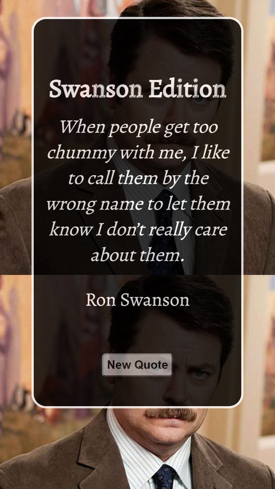

# Quote-Generator

## <section id = "License">License</section>
N/A

## <section id = "Description">Description</section>
This is a simple Ron Swanson quote generator built with HTML, CSS, and JavaScript. The application generates a single quote out of fifty possible quotes randomly when the user clicks on the "Generate Quote" button. The project includes three files: index.html, style.css, and script.js. The HTML file contains the basic structure of the webpage, including the button element that triggers the quote generator. The CSS file provides the styling for the webpage. The JavaScript file contains the code that selects a random quote from an array of fifty quotes and displays it on the webpage. To use the application, simply open the index.html file in a web browser and click the "Generate Quote" button. A single quote from Ron Swanson will be displayed on the screen. Users can generate new quotes by clicking the button again. This project is ideal for anyone who is a fan of the TV show "Parks and Recreation" and wants a quick and easy way to get a dose of Ron Swanson wisdom. It's also a great example of how HTML, CSS, and JavaScript can be used together to create a simple web application.

Link to heroku application: https://cgotts1.github.io/Quote-Generator/

## Table of Contents
1.) <a href = "#License">License</a> 
2.) <a href = "#Description">Description</a> 
3.) <a href = "#Installation">Installation</a>  
4.) <a href = "#Usage">Usage</a> 
5.) <a href = "#Contributing">Contributing</a> 
6.) <a href = "#Tests">Tests</a> 
7.) <a href = "#Questions">Questions</a>

## <section id = "Installation">Installation</section>
Command to Install Dependencies: N/A

## <section id = "Usage">Usage</section>
Using the Repo: N/A 

## <section id = "Contributing">Contributing</section>
Contributing to the Repo: Currently not taking contributions.

## <section id = "Tests">Tests</section>
Command to Run Tests: N/A

## <section id = "Questions">Questions</section>
If you have any questions, please feel free to contact me:   
1.) Github Username: Cgotts1  
2.) Email Address: cobi.gottschalk@gmail.com